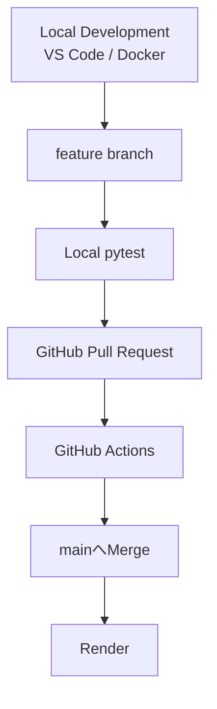

# 🍞 Bakery Hub | Bakery Sales Management System


> **現場の「困った」を、Pythonで「最適解」へ。**

**Bakery Hub** は、18種のテンプレートによる月次商品登録・商品履歴Catalog・日次売上入力・売上分析に加え、  
材料発注リスト・店舗メモ・タスクまで一つの画面で扱える業務支援Webアプリケーションです。

必要なときだけGemini APIへ経営アドバイスを依頼できます。

販売・飲食・物流の現場経験とWebデザインの知識をもとに、

**老若男女が迷わず操作でき、ヒューマンエラーを仕組みで防ぐ、現場目線の業務システム**

を目指して開発しています。

---

## 🚀 オンラインデモ

### [👉 Bakery Hubを体験する](https://bakery-salesdata.onrender.com/)

スマートフォン・PCのブラウザからアクセスできます。

現在は、管理者アカウントを公開せずに実際の業務画面を操作できる  
**Guest Demo** を公開しています。

ログイン画面の

```text
ゲストデモを体験する
```

から体験できます。

ログイン画面は **Tosane WorksのWeb Portfolio入口** も兼ねています。
Store（オレンジ）・Information（水色）・Logistics（緑）のカテゴリごとに作品を表示し、各READMEへ移動できます。Puoppo・Driver Personality TestにはLive Demoへのリンクもあります。Bakery HubのGuest Demoと管理者ログインはStore内に配置しています。

Guest Demoでも、

```text
商品を登録する
      ↓
日次売上を入力する
      ↓
売上ランキング・グラフを見る
      ↓
材料発注リスト・店舗メモ・タスクを使う
      ↓
Geminiへ経営アドバイスを依頼する
```

という実際の業務フローを操作できます。

商品登録は標準18種のテンプレート選択と自由入力に対応しています。Admin専用のCatalog商品申請・画像アップロードはGuestには公開しません。

店舗メモツールでは、現在 **材料発注・メモ・タスク** を利用できます。  
タスクでは、追加・完了 / 未完了・削除・複数選択・長押し並び替えを操作できます。

> [!NOTE]
> Renderの無料インスタンスを使用しているため、しばらくアクセスがない場合はスリープ状態になります。  
> 最初のアクセス時のみ、起動に時間がかかる場合があります。

### Guest Demoの主な制限

```text
Guestごとに専用Datasetを作成
他Guest・Adminのデータとは分離

無操作30分で期限切れ
開始から最大2時間

AI機能
1 Guest Datasetにつき合計3回まで

Guestの商品数
1 Datasetにつき最大30件

1回のProduct / Sales POST
最大30件

同時に存在できる有効Guest
最大10件
```

> [!WARNING]
> Guest Dataset同士、およびAdmin Datasetとは分離していますが、  
> 本システムは実店舗向けの複数ユーザー・複数店舗サービスとして運用しているものではありません。
>
> 公開環境へ個人情報・機密情報・実際の店舗データを入力しないでください。

---

## 📸 スクリーンショット

### PC

<p align="center">
  
</p>

### Smartphone

<p align="center">
  
  
  
</p>

---

## 📖 プロジェクト概要

ベーカリー店舗の日々の商品管理・売上入力・分析と、店舗内の小さな業務を一つにまとめるWebアプリケーションです。

現在のmainでは、主に次の機能を利用できます。

```text
売上管理
├── 商品・メニュー登録（標準18種のテンプレート / 自由入力）
├── 商品一覧（今月 / 過去の履歴Catalog）
├── 日次売上入力
├── 売上分析Dashboard
└── Geminiによる経営アドバイス

店舗メモツール
├── 材料発注リスト
├── 店舗メモ
└── タスク
```

利用者は、次の2種類を明確に分けています。

```text
/login
  │
  ├── Admin
  │     └── 管理者専用Dataset
  │
  └── Guest Demo
        └── Guestごとの一時Dataset
```

AdminとGuestは同じ業務画面を利用できますが、  
参照・更新するデータは認証されたidentityからサーバー側で決定します。

利用者が外部から任意の`dataset_id`を指定して、別Datasetへ切り替える設計にはしていません。

### 基本の業務フロー

```text
ログイン / Guest Demo開始
        ↓
テンプレートまたは自由入力で対象月の商品を登録する
        ↓
本日の販売個数を入力・更新する
        ↓
売上ランキングとグラフを確認する
        ↓
必要に応じて材料発注リスト・店舗メモ・タスクを使う
        ↓
必要なときだけGeminiへ経営アドバイスを依頼する
```

単に機能を実装するだけではなく、

**「忙しい現場でも迷わず操作でき、事故につながる状態をシステム側で防ぐ」**

ことを重視しています。

### 📘 公開「システム概要」

[システム概要を読む（ログイン不要）](https://bakery-salesdata.onrender.com/system-overview)

商品登録・売上入力・Dashboard・材料発注・店舗メモ・タスク・Guest Demo・ログイン・AIの9機能について、Python / Flask / SQLAlchemy / JavaScript / pytestの役割を実装と結びつけて説明しています。処理フロー、理解度チェック8問、トラブル逆引き8項目も掲載。未ログイン・Admin・Guestのいずれでも閲覧できます（PR #72 / #73）。

---

## ✨ 技術的な見どころ

- 標準18種の商品テンプレート（商品名・代表画像・初期価格）と自由入力
- 月ごとのProductと履歴Catalogを区別し、今月 / 過去をDatasetごとに表示
- Admin専用のCatalog商品申請をGitHub PR経由でレビュー・反映（任意画像の検証・WebP化）
- PostgreSQL / SQLAlchemyによるデータ永続化
- Flask-Migrate / AlembicによるDB変更管理
- DatasetによるAdmin / Guest / Guest間のデータ分離
- Guest Sessionの無操作30分・絶対2時間の期限管理
- 期限切れGuest Datasetと関連データのcleanup
- Guest Dataset単位のGemini API合計3回制限
- Guest Session作成rate limit
- 有効Guest Dataset最大10件
- Guestの商品数・POST件数制限
- PostgreSQL上の並行requestを考慮したlock制御
- Dataset単位の材料発注リスト（追加・完了・未完了・削除・100件上限）
- 店舗メモは作成・編集時の1行目をタイトルとして扱い、独立カード + 1行本文プレビューで一覧表示
- 店舗メモの検索・pin・複製・autosave・ゴミ箱・復元・完全削除・Undo・swipe操作
- Dataset単位のタスク（追加・完了 / 未完了・削除・複数選択・長押し並び替え）
- Dashboardの棒グラフ周辺UIとPC / Mobileレイアウトを調整（スマホのグラフ上下端からページスクロールへ引き継ぎ）
- タスク並び替えは実カード追従 + placeholder + FLIPで周囲カードをアニメーション
- HTTP / HTTPS絶対URLだけを安全にlinkifyし、DBにはplain textを保存
- Bakery Hubブランド、inline SVG、カテゴリカラーによる共通Navigation
- Flask-LoginによるAdmin認証
- Session fingerprintによる認証設定変更時のfail-closed
- Adminログイン失敗5回 / 15分のrate limit
- Flask-WTF / CSRFProtect
- XSS対策と回帰テスト
- Session CookieのSecure / HttpOnly / SameSite設定
- Security Headers / HSTS
- GitHub ActionsによるSQLite + PostgreSQL 16の二層CI
- Falsification / Mutation Testing（2026年8月の手動11件、10月のCodex + Cosmic Rayによる1,286件の再監査）
- 学習用の公開「システム概要」（9機能・理解度チェック・トラブル逆引き）
- 月替わり・年替わり事故の回帰テスト
- 本日の売上金額KPI（日本時間・表示期間とは独立した当日集計）
- PC Dashboardの主要領域を1画面内で確認しやすくするコンパクトな配置
- Tosane WorksのWeb Portfolio入口として、ログイン画面に3カテゴリの作品導線を配置
- 2026-10-07の[PR #81](https://github.com/tosane932/tosane-works/pull/81)で正式pytestだけをmainへ反映：出荷前のfull pytest **1,009 collected / 991 passed / 18 skipped / 0 failed / 9 warnings**

---

## 📊 売上管理の3ステップ

### 1. 商品メニューと価格を登録する

対象月の商品名と価格を登録します。標準18種から選ぶと商品名・代表画像・初期価格が設定され、自由入力での商品追加も可能です。

登録済み商品の更新は商品IDを基準に行います。テンプレート商品は商品名を固定表示し、実際の売価は初期価格と分けて管理します。

販売終了商品は物理削除せず、

```text
is_active = False
```

とする論理削除方式です。

これにより、販売終了後も過去の売上履歴を維持できます。

Guest Demoでは、1 Datasetにつき最大30商品まで登録できます。商品名は1〜100文字、売価は0〜9,990円の10円単位です。日次売上の販売数量は0〜1,000個を扱います。

---

### 2. 本日の販売個数を入力・更新する

日次売上入力画面では、商品ごとに現在保存されている数量を表示します。

```text
高級食パン
🟢 本日の登録済み：14個
```

入力欄にも現在値を表示します。

14個登録済みの商品へ17個を入力した場合、

```text
14 + 17 = 31
```

ではなく、

```text
14 → 17
```

と更新します。

そこで画面上でも、

```text
💾 本日の売上個数を更新する
```

と表現しています。

また、入力欄へフォーカスした際には現在値を選択状態にし、

```text
30
↓
35を入力
↓
35
```

となるよう、既存値を削除する手間を減らしています。

---

### 3. 売上分析・ランキングを見る

ダッシュボードでは、

- 商品別売上ランキング
- 本日の売上金額（日本時間）
- 売上数量グラフ
- 年月別集計
- 販売終了商品の過去売上
- Gemini APIによる経営改善提案

などを確認できます。

PR #49では、棒グラフ周辺のUIとPC / スマートフォンのレイアウトを見直し、グラフを読み取りやすく操作しやすい構成へ調整しました。

PR #58では、表示中の年月にかかわらず、認証済みDatasetの当日売上を「登録単価 × 販売数量」で集計するKPIを追加しました。該当する売上がなければ0円を表示します。
PCでは幅1100px以上・高さ650px以上でグラフとランキングを左右に配置し、主要領域を1画面内で確認しやすくしています。ランキングとAI回答はパネル内でスクロールでき、狭い画面や高さが不足する場合は通常のページスクロールを使います。

月の選択欄では、売上データ（`DailySales`）が存在する月に「登録済み」と表示します。

```text
10月（登録済み）
```

商品登録画面でも商品を登録した月に「登録済み」と表示しますが、判定条件は異なります。**商品登録画面はProductの登録状況、DashboardはDailySalesの存在**を示しています。

表示年月を変更した場合は、

```text
🔍 データを抽出
```

を押してDashboardを更新します。

---

## 🥐 商品テンプレート・履歴Catalog・Admin申請（2026年10月）

| 機能 | 現在の仕様 |
|---|---|
| 商品テンプレート | 標準18種を選ぶと商品名・画像・初期価格を設定。自由入力も可能 |
| 月次Product | 対象年月・Datasetごとに登録。Catalogの追加だけでは作成しない |
| 商品一覧 | 今月の有効商品と過去月の最新履歴を分けて表示。同名商品は今月側を優先 |
| 履歴保持 | 過去のProduct・価格・画像key・DailySalesを保持し、一覧取得時にDBを更新しない |
| Admin商品カタログ | Admin専用フォームで商品名・初期価格・ひらがなの読み・任意画像を申請 |
| 審査・反映 | GitHubへ専用branchとPRを作成。レビュー・merge後、設定されたデプロイで反映 |
| 画像 | JPEG / PNG / WebPを検証し、必要に応じて縮小してWebPで保存。画像なしも選べる |
| Guest | Catalog申請・編集・画像アップロードは利用不可。Datasetの分離も維持 |

**初期価格はテンプレートの基準値、実売価は月次Productの価格**です。両者を混同せず、過去の売上記録も消さない構成にしました。Adminからの申請は、実行中のRenderコンテナを直接書き換えるのではなくGitHub PRで変更を確認する方式です（PR [#79](https://github.com/tosane932/tosane-works/pull/79) / [#80](https://github.com/tosane932/tosane-works/pull/80)）。本番でAdmin申請機能を利用するには、別途GitHub tokenなどの適切な設定が必要です。

---

## 🧰 店舗メモツール

売上管理とは別に、店舗内で頻繁に発生する小さな業務をまとめる領域です。

| ツール | 現在のmain |
|---|---|
| 材料発注 | 材料名・数量メモ・補足を登録し、完了 / 未完了を切り替え |
| 店舗メモ | 1行目タイトル・1行本文プレビュー、検索、pin、複製、autosave、ゴミ箱、復元、完全削除 |
| タスク | 追加・完了 / 未完了・削除・複数選択・長押し並び替え |

材料発注・店舗メモ・タスクはProductとは独立したモデルとして保存し、  
いずれも現在のDatasetに所属するデータだけを参照・更新します。

PR #64ではスマートフォン上部の余白と固定メニューボタンを調整し、PR #65では材料発注フォームをコンパクトにしました。材料名・数量メモを横並びにし、補足メモ欄の高さや余白を抑えています。

---

## ⚙️ 主な機能

| 分類 | 機能 |
|---|---|
| Admin認証 | Flask-Login・password hash・Session fingerprint |
| Guest Demo | 認証情報不要の一時体験環境 |
| Dataset分離 | Admin / Guest / Guest間のデータ境界 |
| Guest期限 | 無操作30分・絶対2時間 |
| Guest cleanup | 期限切れDatasetと関連データの削除 |
| Guest作成制御 | rate limit・有効Guest最大10件 |
| 商品上限 | Guest 1 Dataset最大30商品 |
| POST制限 | Guest Product / Sales最大30件 |
| Admin rate limit | ログイン失敗5回 / 15分 |
| CSRF | Flask-WTF / CSRFProtect |
| Session Cookie | Secure・HttpOnly・SameSite=Lax |
| Security Header | HSTS・X-Frame-Optionsなど |
| 商品管理 | 標準18種テンプレート・自由入力・月次Product・実売価編集 |
| 商品一覧 / Catalog | 今月の登録中商品と過去の履歴をDataset単位で表示 |
| Admin Catalog申請 | GitHub PRを介したAdmin専用商品登録・任意画像アップロード |
| 販売終了 | `is_active`による論理削除 |
| 日次売上 | 商品別販売数・同日データ上書き |
| 状態表示 | 現在の登録済み個数を表示 |
| 売上分析 | 年月別集計・ランキング・グラフ・本日の売上金額KPI・PCのコンパクト配置 |
| 材料発注 | Dataset単位の追加・完了 / 未完了・削除・最大100件 |
| 店舗メモ | 1行目タイトル・1行本文プレビュー・作成・編集・検索・pin・複製・autosave |
| メモ削除 | ゴミ箱・復元・完全削除・Undo・下swipeで通知を閉じる |
| URL表示 | HTTP / HTTPS絶対URLだけを安全に自動リンク化 |
| Mobile UI | 長押し・swipe・Undo・FAB・responsive editor |
| Navigation | Bakery Hubブランド・inline SVG・カテゴリカラー |
| システム概要 | 公開教材ページ・9機能の技術説明・処理フロー・理解度チェック8問・トラブル逆引き8項目 |
| Portfolio入口 | ログイン画面にStore / Information / Logisticsの作品・README・デモ導線 |
| タスク | Dataset単位の追加・完了 / 未完了・削除・複数選択・長押し並び替え |
| AI | Gemini APIによる日次支援・経営アドバイス |
| AI制限 | Guest Dataset単位で合計3回 |
| DB整合性 | 一意制約・CHECK・transaction・rollback・row lock |
| XSS対策 | DOM API・Jinja2 autoescape・安全なlinkify |
| Migration | Flask-Migrate / Alembic |
| CI | GitHub Actions（SQLite + PostgreSQL 16） |
| テスト | pytest・Falsification・Mutation Testing（手動方式・Cosmic Ray） |

---

## 🛠 技術スタック

### Backend

- Python 3.12
- Flask 3.1
- SQLAlchemy
- Flask-Migrate
- Alembic
- Flask-Login
- Flask-WTF
- Werkzeug
- Gunicorn

### Frontend

- HTML
- CSS
- JavaScript
- Jinja2
- Fetch API
- Chart.js

### Database

- PostgreSQL
- SQLite（ローカル開発・通常テスト）

### AI

- Google Gemini API
- Google GenAI SDK
- Prompt Engineering

### Infrastructure

- Docker
- Docker Compose
- Render
- Git
- GitHub
- GitHub Actions

### Quality / Security

- pytest
- Falsification
- Manual Mutation Testing
- Cosmic Ray 8.7.0（監査用ツール、Codex経由で実行）
- CSRF Protection
- XSS Regression Testing
- Dataset Isolation Testing
- Migration Testing
- Security Header Testing
- PostgreSQL Integration Testing

---

## 📚 詳細な設計・実装内容

以下の項目は、見出しをクリックすると展開できます。

---

<details>
<summary><strong>🛒 材料発注リストを見る</strong></summary>

<br>

材料発注は、売上用のProductとは独立した`MaterialOrderItem`として管理します。

主な項目は、

```text
name           最大100文字
quantity_text  最大30文字
memo           最大300文字
is_completed
created_at
completed_at
```

です。

1 Datasetにつき最大100件とし、新規作成時はDataset rowをlockしてから件数を再確認します。  
これにより、PostgreSQL上で同時requestが発生した場合でも上限超過を防ぎます。

完了状態の変更と削除も、現在のDatasetに所属するitemだけを取得し、row lockを行ってから更新します。

`is_completed = true` のときだけ `completed_at` を持つようDB CHECK制約でも整合性を確認しています。

DB例外時はrollbackし、別Datasetのitem IDを送られても更新対象にしません。

</details>

---

<details>
<summary><strong>📝 店舗メモを見る</strong></summary>

<br>

店舗メモは`ShopMemo`としてDataset単位で保存します。

現在の主な仕様は、

```text
タイトル  最大100文字
本文      最大2000文字
検索語    最大100文字

通常 + Trash
1 Datasetにつき最大100件
```

です。

主な操作は次のとおりです。

- 新規作成・編集
- 1行目を太字タイトルとして表示
- 本文を1行プレビューし、長い内容は省略表示
- PC / スマートフォンとも縦1列の独立カード型一覧
- タイトル / 本文検索
- pin / unpin
- 複製
- autosave
- ゴミ箱移動
- 復元後もTrash画面を維持
- Trashからの完全削除
- 完全削除時の標準確認ダイアログ
- 削除直後のUndo
- 削除通知を下swipeで閉じる操作
- スマートフォンでの長押しmenu・swipe操作

本文に含まれるURLは、`http://` / `https://` の明確な絶対URLだけを表示時にlinkifyします。  
DBへHTMLを保存せずplain textを維持し、本文・URL表示文字列・hrefを個別にescapeします。

検索・pin・autosave・削除系routeでも現在のDatasetを条件に含め、  
Admin / Guest / Guest間の越境を防ぎます。

スマートフォンでは、画面幅・virtual keyboard・touch操作を前提にUIを調整しています。  
タスク機能は別の`ShopTask`モデルとして実装し、店舗メモと同じDataset境界の中で利用できます。

</details>

---

<details>
<summary><strong>✅ タスク機能を見る</strong></summary>

<br>

タスクは`ShopTask`としてDataset単位で保存します。

主な項目は、

```text
title         最大100文字
is_completed 完了状態
completed_at 完了日時
position      並び順
```

です。

現在の主な操作は次のとおりです。

- 新規作成
- 完了 / 未完了
- 削除
- 複数選択
- 完了済みグループ表示
- 長押しによる並び替え

スマートフォンの並び替えでは、複製したghostではなく**実際のTaskカード本人**を指へ追従させます。  
元の場所は`placeholder`で確保し、周囲のカードはFLIPを用いて滑らかに移動させています。

並び替え成立の境界も実機で調整し、隣接カードへほぼ100%重なるまで待つのではなく、約75%重なった段階で周囲が避けるようにしています。

PR #46時点では、JavaScript変更後にChrome headlessでも構文エラーを確認し、Task専用テストは**69 passed**、full pytestは**742 passed / 17 skipped**でした。

</details>

---

<details>
<summary><strong>🗂 DatasetによるAdmin / Guest分離を見る</strong></summary>

<br>

Guest Demo公開にあたり、`Dataset`をデータ境界として導入しました。

```text
Dataset
├── Admin Dataset
├── Guest Dataset A
├── Guest Dataset B
└── Guest Dataset C
```

Product・MaterialOrderItem・ShopMemo・ShopTaskは、それぞれ所属する`dataset_id`を持ちます。

商品・日次売上・Dashboard・AI分析・材料発注・店舗メモ・タスクなどの処理では、  
現在認証されている利用者が利用できるDatasetだけを対象にします。

```text
Guest A
↓
Guest Bの商品・売上を参照しない

Guest
↓
Adminの商品・売上を参照しない
```

Guest AからGuest Bの商品IDを送信した場合でも、  
現在のDatasetに所属する商品として解決できなければ更新処理へ進みません。

Dashboardについても、

```text
HTML表示
API集計
売上存在月
ランキング
AI prompt
```

までDataset単位で絞り込みます。

外部から`dataset_id`を送信して対象Datasetを切り替える方式ではなく、  
認証済みidentityからサーバー側でDatasetを決定します。

既存のAdminデータについては、Alembic migrationを利用して、

```text
Datasetテーブル追加
↓
Admin Dataset作成
↓
既存ProductをAdmin Datasetへbackfill
↓
Product.dataset_idをNOT NULL化
```

という段階的な移行を行いました。

> [**補足**]
> 一般的な複数ユーザー・複数店舗向けtenant機能を完成させたという意味ではありません。  
> 現在は単一Adminと一時Guest Datasetを分離する構成です。

</details>

---

<details>
<summary><strong>⏱ Guest Datasetの期限・cleanupを見る</strong></summary>

<br>

Guest Datasetでは主に、

```text
created_at
last_activity_at
absolute_expires_at
```

を管理します。

現在の期限は、

```text
無操作期限
30分

絶対期限
2時間
```

です。

無操作期限は利用中の活動によって更新されますが、  
絶対期限は延長しません。

Guest Datasetの利用時には期限を確認し、期限切れの場合は業務処理へ進ませません。

さらに新しいGuest Session作成時には、期限切れGuest Datasetをcleanupします。

削除順序は、

```text
MaterialOrderItem / ShopMemo / ShopTask
            ↓
        DailySales
            ↓
          Product
            ↓
          Dataset
```

です。

Admin Datasetや有効Guest Datasetはcleanup対象へ含めません。

### cleanup競合対策

最初の期限判定時には期限切れだったGuestでも、  
削除直前までに利用者が操作して`last_activity_at`が更新される可能性があります。

そこで削除候補をそのまま信用せず、

```text
期限切れ候補を取得
↓
削除直前に最新rowを再取得
↓
row lock
↓
期限を再判定
↓
まだ期限切れなら削除
```

という流れにしています。

これにより、

```text
最初は無操作30分超過
↓
利用者が操作して活動時刻更新
↓
古い判定だけを使って削除
```

という事故を防ぎます。

次のようなケースもテストしています。

- 絶対期限切れ
- 無操作期限切れ
- 境界時刻
- 有効Guest保持
- Admin保持
- cleanup冪等性
- cleanup途中のDBエラーとrollback
- 同時cleanup
- cleanupとGuest活動の競合

</details>

---

<details>
<summary><strong>🤖 Gemini API・Guest AI利用制限を見る</strong></summary>

<br>

Gemini APIはページ表示だけでは実行しません。

```text
日次売上入力
└── 今日のひとことを聞く

Dashboard
└── 詳しいアドバイスを聞く
```

利用者が明示的に操作したときだけAPIを呼び出します。

Guest Demoでは、

```text
/api/greeting
+
/api/ai-advice
=
合計3回
```

まで利用できます。

1 Guest Datasetごとに独立した回数を管理します。

```text
Guest A
3回

Guest B
3回
```

のように、別Guestの利用回数は混ざりません。

4回目以降はHTTP 429を返し、Gemini APIへ進みません。

### atomicな利用権確保

単純な、

```text
SELECT
↓
Pythonで回数確認
↓
+1
```

では、同時request時に上限を超える可能性があります。

そこでDB側で条件付きUPDATEを行い、

```text
guest_ai_usage_count < 3
期限内
現在のGuest Dataset
```

を満たした場合だけ1回分の利用権を確保します。

commit後にGemini APIを呼び出すため、  
Geminiの応答待ち中にDB transactionを保持し続けない構成です。

Gemini API側で、

```text
429
503
timeout
その他のAPIエラー
```

が発生した場合でも、すでに確保した利用回数は戻しません。

一方、

```text
API Keyがない
対象売上データがない
Geminiを呼び出さないfallback
```

では回数を消費しません。

### Guest prompt上限

公開Demoから送信されるAI promptが無制限に大きくならないよう、  
GuestのAI adviceでは対象Datasetの売上を集計したうえで上位商品数を制限しています。

商品名や数量についても送信前に再検証します。

AI APIはPOSTとして扱い、CSRF保護も適用しています。

</details>

---

<details>
<summary><strong>🚧 Guest Demoの公開防御を見る</strong></summary>

<br>

公開Demoでは、

```text
機能が正常に動く
```

だけではなく、

```text
大量アクセスされたら？
同時requestされたら？
上限を回避されたら？
```

という前提でも確認しています。

### Guest Session作成rate limit

Guest Session作成にはclient単位のrate limitを設定しています。

client識別では、生IPそのものをDBへ保存せず、  
HMAC-SHA256で匿名化したkeyを使用します。

```text
Client IP
↓
検証・正規化
↓
HMAC-SHA256
↓
匿名client key
```

rate limitの利用回数はGuest Dataset作成前に確保します。

そのため、後段でDataset作成に失敗した場合でも、  
確保済みの利用回数を戻して大量試行を許可することはしません。

設定不備・client情報不備・DB障害時は安全側へ倒し、Guest作成を拒否します。

### 有効Guest Dataset数

同時に存在できる有効Guest Datasetは既定値で最大10件です。

Guest開始時には、

```text
cleanup
↓
現在の有効Guest数を確認
↓
上限未満なら新規Dataset作成
```

という順で処理します。

PostgreSQLではadvisory lockを利用し、  
複数requestが同時に「まだ空きがある」と判断する競合を抑えています。

### 商品・POST上限

Guestでは、

```text
1 Datasetあたりの商品総数
最大30

1回のProduct POST
最大30件

1回のSales POST
最大30件
```

としています。

論理削除した商品もGuest Datasetの生涯商品数として数えるため、  
削除と再登録を繰り返して無制限にデータを増やすことを防ぎます。

既存Productの更新や論理削除自体は、新規商品枠を消費しません。

同時Product POSTについてもPostgreSQL上で上限を超えないことを確認しています。

</details>

---

<details>
<summary><strong>🔐 Admin認証・Session・rate limitを見る</strong></summary>

<br>

管理者側はFlask-Loginによる単一管理者方式です。

認証情報は環境変数から取得します。

```text
SECRET_KEY
ADMIN_USERNAME
ADMIN_PASSWORD_HASH
```

平文passwordをコード内へ保存せず、Werkzeugのpassword hashを利用します。

### Session fingerprint

ログイン時には現在の`ADMIN_PASSWORD_HASH`からfingerprintを生成し、Sessionへ保存します。

```text
ログイン時
↓
現在の認証設定からfingerprint生成
↓
Sessionへ保存
```

Session復元時には、

```text
現在の認証設定
↓
fingerprint生成
↓
Session内のfingerprintと比較
```

します。

次の場合は既存Sessionを認証済みとして扱いません。

```text
fingerprintが存在しない
fingerprintが一致しない
管理者設定が不足
password hashが無効
```

これにより、管理者password hash変更後に古いSessionが残り続ける状態を防ぎます。

### Admin login rate limit

管理者ログイン失敗には、

```text
5回 / 15分
```

のrate limitを設定しています。

```text
1〜5回目
HTTP 401

6回目以降
HTTP 429
```

上限到達中は、正しい認証情報を送信した場合でも429として扱います。

また、

```text
wrong username
wrong password
```

によって外部レスポンスを変えません。

Guest作成rate limitとは別のHMAC domain・counterを使用しています。

PostgreSQLでは、同一clientの、

```text
上限確認
↓
credential検証
↓
成功判定
↓
失敗counter更新
```

を直列化し、並行requestによるrate limitすり抜けも検証しています。

</details>

---

<details>
<summary><strong>🛡 CSRF・XSS・Security Headersを見る</strong></summary>

<br>

### CSRF保護

Flask-WTFの`CSRFProtect`を利用しています。

状態を変更するPOSTやAI APIについて、CSRF tokenを確認します。

```text
tokenなし
↓
HTTP 400

改ざんtoken
↓
HTTP 400
```

拒否された場合に、

- Admin Sessionが作成されない
- Guest Datasetが作成されない
- Productが変更されない
- DailySalesが変更されない
- Guest AI利用回数を消費しない
- Gemini APIを呼び出さない

こともテストしています。

### XSS対策

動的ランキングやAI返答表示では、

```javascript
document.createElement()
textContent
createTextNode()
replaceChildren()
innerText
```

などを利用します。

未信頼データをHTMLとして解釈する処理を避けています。

Jinja2による初期表示についてもautoescapeを利用します。

回帰テストでは、

```text
innerHTML
outerHTML
insertAdjacentHTML
```

などのHTML sinkが重要な商品名表示処理へ混入していないかも確認しています。

### Session Cookie

Session Cookieでは、

```text
Secure
HttpOnly
SameSite=Lax
```

を設定しています。

ローカルHTTP開発では、環境変数によって`Secure`を無効化できるよう、本番設定と分離しています。

### Security Headers

主に次のHeaderを追加しています。

```text
X-Content-Type-Options: nosniff

Referrer-Policy:
strict-origin-when-cross-origin

Permissions-Policy:
camera=(), microphone=(), geolocation=()

X-Frame-Options:
DENY

Strict-Transport-Security:
max-age=86400
```

CSPについても限定的なポリシーから導入しています。

```text
frame-ancestors 'none'
base-uri 'self'
object-src 'none'
form-action 'self'
```

強い`script-src` / `style-src`などは、既存Frontendへの影響を確認しながら段階的に強化する方針です。

</details>

---

<details>
<summary><strong>🧪 pytestを「事故防止台帳」として育てた記録を見る</strong></summary>

<br>

このプロジェクトでは、pytestの件数そのものより、

> **一度見つけた事故やヒヤリハットを、次から自動的に止めること**

を重視しています。

最初は3件だったpytestを段階的に拡充しました。

```text
開始時
3 passed

第1段階
9 passed

第2段階
51 passed

第3段階
69 passed

第4段階
87 passed

第5段階
91 passed

Dataset / Guest Demo実装
↓
200件超

公開Guest入口・公開防御
↓
300件超

材料発注・店舗メモ・UI刷新
↓
600件超

店舗タスク・並び替えUX
↓

PR #49時点
742 passed / 17 skipped

2026-09-30 / CI #234（commit e64d0d6）
756 passed / 18 skipped

2026-10-07 / PR #81 出荷前のfull pytest
1,009 collected / 991 passed / 18 skipped / 0 failed / 9 warnings
```

現在は、

```text
Product
DailySales
MaterialOrderItem
ShopMemo
ShopTask
Dashboard
AI
XSS
Admin認証
Session fingerprint
CSRF
Authorization
Migration
Dataset分離
Guest identity
Guest Session
Guest期限
cleanup
cleanup競合
Guest AI利用上限
Guest作成rate limit
有効Guest数上限
商品数上限
並行Product POST
材料発注100件上限
材料発注の並行request
店舗メモ100件上限
店舗メモのDataset分離
店舗メモのTrash / restore / permanent delete
店舗メモのautosave / pin / URL linkify
店舗タスクのDataset分離・完了状態・並び替え
Mobile UI / SVG Navigation
AI prompt制限
Admin login rate limit
並行Admin login
Security Headers
HSTS
月替わり
年替わり
```

などを対象にしています。

### PostgreSQL専用テスト

2026-09-30のCI #234では、通常suiteの18件がテスト用PostgreSQL環境を必要とするためskipされています。

通常のSQLiteテストだけで、

```text
PostgreSQL上でも並行性が安全
```

とは扱わず、必要な機能については使い捨てPostgreSQL環境で実際の並行requestを検証しています。

対象には、

- Guest cleanup競合
- Guest有効数上限
- Guest商品数上限
- Admin login rate limit
- 材料発注100件上限と並行request
- 店舗メモのDataset分離・100件上限・rollback
- 店舗タスクのDataset分離・整合性・並び替え
- Alembic migration

などがあります。

GitHub Actionsでは通常pytestに加えてPostgreSQL 16のintegration jobを実行し、  
[2026-09-30のBakery Hub Tests #234](https://github.com/tosane932/tosane-works/actions/runs/36668156708)（commit `e64d0d6`）では、通常pytestは **756 passed / 18 skipped**、PostgreSQLのmigration確認は **1 passed**、後続のintegration suiteは **16 passed** で、両jobとも成功しています。
今回確認したmain（`149b73e`）との差分はルートREADMEへのWeb Portfolioリンク追加だけで、アプリ・テスト・CI設定は同じです。上記は当該CIの実行結果であり、今回ローカルでpytestを再実行した結果ではありません。

</details>

---

<details>
<summary><strong>📅 月替わり・年替わり事故の再発防止を見る</strong></summary>

<br>

2026年9月への月替わり時に、8月固定だったテストデータと、

```python
today.month
today.year
```

を利用するproduction codeの条件が一致しなくなり、pytestがREDになりました。

問題の原因はproduction codeの不具合ではなく、

```text
テストデータ側が2026年8月固定
```

だったことです。

単純に9月へ書き換えるだけでは、翌月に同じ事故が再発します。

そこで、

```text
現在日付からテストデータを作成
```

する形へ修正しました。

さらに事故そのものを回帰テストへ残すため、

```text
2026-09-01
```

へ日時を固定する月替わりテストと、

```text
2027-01-01
```

へ固定する年替わりテストを追加しました。

一時的に、

```python
month=today.month
```

を削除すると月替わりテストがREDになり、

```python
year=today.year
```

を削除すると年替わりテストがREDになることも確認しています。

そのため、

```text
テストが存在する
```

だけではなく、

```text
本当にmonth / year条件の欠落を検出できる
```

ことまで確認しています。

</details>

---

<details>
<summary><strong>🧬 2026年8月のFalsification / 手動Mutation Testingを見る</strong></summary>

<br>

pytestがGREENでも、

```text
重要条件を本当に検出できているのか？
```

を確認するため、代表的な条件を意図的に壊すManual Mutation Testingを行いました。

初回検証では、

```text
KILLED
6件

SURVIVED
5件
```

でした。

SURVIVEDした条件を分析し、fixtureやassertionを強化しました。

主な例は、

```text
AI年月filter
↓
前年同月データをfixtureへ追加

Admin Session
↓
fingerprint欠落状態を再現

売上更新
↓
同一商品の別日売上を追加

XSS
↓
安全なAPIの存在だけでなくHTML sink混入を検知

初期ランキング
↓
Jinja2 autoescapeを実表示経路で確認
```

です。

その後、同じ条件を再び壊し、

```text
選択した11 Mutation
↓
すべてRED
```

になることを確認しました。

> [**補足**]
> アプリ全体のMutation Score 100%を意味するものではありません。  
> 重要な仕様を代表する11条件を手動で選択して検証したものです。

</details>

---

<details>
<summary><strong>🧪 2026年10月のCodex / Cosmic Ray再監査を見る</strong></summary>

<br>

2026年10月3日〜7日、Phase 0〜25でMutation Testingの2回目の監査を実施しました。Codexへコード変更・pytest実行・記録・復元を任せ、Cosmic Ray 8.7.0も併用しました。監査方針・KILLEDの判定条件・終了Gateは人間側で管理しました。

| 監査結果（重複除外） | 件数 |
|---|---:|
| 手動方式（Codexに実行を指示） | 60 |
| Cosmic Ray | 1,226 |
| **合計** | **1,286** |
| KILLED | 1,190 |
| SURVIVED | 68 |
| ERROR | 27 |
| TIMEOUT | 0 |
| EQUIVALENT | 1 |

保存済みの監査証拠で確認できるpytest追加は193ケースです（**PR #81での収集件数増分とは異なります**）。正式テストは「正常コードでGREEN → 対象Mutationによって狙ったassertでRED → 復元後GREEN」を確認しました。

監査ブランチをそのままmainへmergeせず、PR #80反映後の最新版mainを基点に**正式pytestの7ファイルだけ**を移植しました（新規6ファイル、既存1ファイル）。監査専用DB・ログ・Mutationコードなどは反映していません。

- [PR #81：pytestの強化をmainへ反映](https://github.com/tosane932/tosane-works/pull/81)（2026-10-07 merge）
- 出荷前のfull pytest：**1,009 collected / 991 passed / 18 skipped / 0 failed / 9 warnings**
- 9 warningsはSQLite migrationテストのPython 3.12 datetime adapter非推奨警告

> [!IMPORTANT]
> SURVIVED 68件とERROR 27件が残っています。Final Gateの成立は、すべての故障を検知できたという意味ではありません。また、今回の出荷検証では実ブラウザ・実PostgreSQL・本番DB・Render・実Gemini APIを検証していません。

</details>

---

<details>
<summary><strong>🗄 Migration・既存データ移行を見る</strong></summary>

<br>

Flask-Migrate / Alembicを利用してDB構造の変更履歴を管理しています。

途中からmigrationを導入したことで、過去には、

```text
空DB
↓
flask db upgrade
↓
productsテーブルが存在しない
```

という問題が発生しました。

そこで基礎revisionを追加し、

```text
空DB
↓
Alembic base
↓
upgrade
↓
head
```

まで構築できる状態へ修復しました。

pytestでも、

- 必要table
- 必要column
- Alembic revision
- 一意制約

などを自動確認します。

### Dataset導入時のmigration

Guest Demo実装時には、既存Adminデータを失わないよう、

```text
datasetsテーブル追加
↓
products.dataset_idをNULL可で追加
↓
Admin Dataset作成
↓
既存Productをbackfill
↓
外部キー・INDEX追加
↓
NULL / orphan確認
↓
dataset_idをNOT NULL化
```

という段階で移行しました。

migration前後で、

```text
Product件数
Product ID
DailySales件数
DailySales ID
```

が維持されていることも検証しています。

Guest AI利用回数やGuest rate limitについても、必要なschema変更はAlembic revisionとして管理しています。

</details>

---

<details>
<summary><strong>🎨 UI設計・ヒューマンエラー防止を見る</strong></summary>

<br>

本アプリでは、

```text
利用者が注意すれば間違えない
```

ではなく、

```text
注意しなくても間違えにくい
```

画面を目指しています。

### 現在値を表示する

日次売上画面では、

```text
今日この商品を入力したか？
現在何個なのか？
入力すると加算されるのか？
```

という迷いを減らすため、現在の登録値を表示します。

```text
高級食パン

🟢 本日の登録済み：14個
```

入力欄にも同じ14を表示します。

### 「保存」と「更新」を区別する

同じ商品・同じ日付へ再入力した場合は、

```text
14 + 17 = 31
```

ではなく、

```text
14 → 17
```

です。

そのためボタンも、

```text
保存する
```

ではなく、

```text
本日の売上個数を更新する
```

としています。

内部処理と利用者へ伝える言葉を一致させる方針です。

### 入力欄の既存値を選択

現在値30を35へ変更するとき、

```text
30を削除
↓
35を入力
```

する必要がないよう、入力欄へフォーカスした時点で現在値を選択します。

```text
30
↓
フォーカス
↓
35入力
↓
35
```

とできます。

### 売上が存在する月を表示

Dashboardでは、売上データ（`DailySales`）が存在する月に「登録済み」を表示します。

```text
9月（登録済み）
```

これは商品登録の有無ではなく、選択年・現在のDatasetに売上データがあることを示します。商品登録画面の「登録済み」は、対象月の商品の登録状況を示す別の表示です。

### 色だけに頼らない

操作ごとに色を使い分けていますが、色だけで意味を伝えません。

- アイコン
- 文言
- 配置
- ボタン形状
- 色

を組み合わせます。

老若男女が迷わず操作できることを重視しています。

</details>

---

<details>
<summary><strong>🏗 システム構成・開発フローを見る</strong></summary>

<br>

### システム構成

```text
Browser
    │
    ▼
Gunicorn
    │
    ▼
Flask
    │
    ├── Flask-Login
    │
    ├── CSRFProtect
    │
    ├── Dataset Authorization
    │
    ├── Rate Limit
    │
    ├── SQLAlchemy
    │      │
    │      ▼
    │   PostgreSQL
    │
    └── Gemini API
```

AdminとGuestでは認証経路が異なります。

Product・DailySales・MaterialOrderItem・ShopMemo・Dashboard・AIなどの業務データを扱う場合は、  
現在のidentityから利用可能なDatasetをサーバー側で解決します。

### 開発フロー



基本的には、

```text
現象確認
↓
原因を切り分ける
↓
必要に応じてREDテスト
↓
最小修正
↓
対象pytest
↓
関連pytest
↓
全pytest
↓
diff確認
↓
Pull Request
↓
GitHub Actions
↓
mainへMerge
```

という流れで進めます。

また、リポジトリには`AGENTS.md`を置き、AI開発支援ツールに対しても、

- Git履歴を書き換えない
- 未確認変更を破棄しない
- pytestを弱めてGREENにしない
- 実行していない確認を「確認済み」と報告しない
- 本番DBやRender操作を勝手に行わない

などの安全ルールを共有しています。

</details>

---

<details>
<summary><strong>💡 開発思想を見る</strong></summary>

<br>

物流現場で身につけた「かもしれない運転」の考え方を、Webアプリケーション開発にも取り入れています。

```text
「今日何個入力したか分からなくなるかもしれない」
↓
現在の登録済み個数を表示する

「入力した数字が追加か更新か分からないかもしれない」
↓
現在値を表示し「更新」と明記する

「不正な値が一部だけ保存されるかもしれない」
↓
全件validation後にDB更新する

「DB更新途中で失敗するかもしれない」
↓
transactionをrollbackする

「同じ商品・同じ日の売上が重複するかもしれない」
↓
DBにも一意制約を設定する

「Guestが他人のデータを見るかもしれない」
↓
Dataset境界を設ける

「session値を書き換えてAdminへ昇格するかもしれない」
↓
identityとDataset解決をサーバー側で行う

「Guestが放置され続けるかもしれない」
↓
無操作期限と絶対期限を設ける

「cleanup対象だったGuestが直前に操作するかもしれない」
↓
削除直前に最新状態を再取得して再判定する

「Guestを大量作成されるかもしれない」
↓
rate limitと同時有効数上限を設ける

「同時requestで上限を突破されるかもしれない」
↓
DB transactionとlockで競合を考慮する

「AI APIを大量利用されるかもしれない」
↓
Guest Dataset単位で利用回数を制限する

「管理者ログインを総当たりされるかもしれない」
↓
rate limitを設ける

「月が変わっただけでテストが壊れるかもしれない」
↓
月替わり・年替わりを固定日時で回帰テストする

「pytestがGREENでも重要条件を見逃しているかもしれない」
↓
FalsificationとMutation Testingで検出力を確認する
```

主に次の考え方を重視しています。

- Fail Fast
- Fail Closed
- 入力validation
- DB制約
- transaction / rollback
- 認証
- CSRF
- XSS対策
- Dataset分離
- rate limit
- Security Headers
- 回帰テスト
- Falsification
- Mutation Testing
- 現在状態を見せるUI
- ヒューマンエラーを仕組みで防ぐ

### 現場経験を生かした設計

開発者は物流業務に加えて、全国の百貨店催事場で広島風お好み焼きの調理・実演販売を経験しています。

- 商品を作る
- セールストークを考える
- 接客する
- 販売する
- 材料を発注する
- 売上を管理する
- スタッフを採用・管理する

という店舗運営に携わりました。

その経験から、

> **機能が存在するだけでは、現場では使えない**

という考えをUIや業務フローへ反映しています。

Webデザインで学んだ、

- 視線誘導
- 配色
- 情報の優先順位

と、販売・物流現場で得た利用者視点を組み合わせ、

**忙しい現場でも迷いにくく、誤操作しにくい画面**

を目指しています。

</details>

---

<details>
<summary><strong>🚀 セットアップ手順を見る</strong></summary>

<br>

### 1. リポジトリをクローン

```bash
git clone https://github.com/tosane932/tosane-works.git
```

```bash
cd tosane-works/store/bakery-hub
```

### 2. 環境変数を作成

```bash
cp .env.example .env
```

主な環境変数は次のとおりです。

```env
LOCAL_DEVELOPMENT=true
GEMINI_API_KEY=
SECRET_KEY=
ADMIN_USERNAME=local-admin
ADMIN_PASSWORD_HASH=
GUEST_CREATION_RATE_LIMIT_MAX_ATTEMPTS=5
GUEST_CREATION_RATE_LIMIT_WINDOW_SECONDS=60
```

`LOCAL_DEVELOPMENT=true`は、手元のPCで直接Flaskへ接続するときだけ設定します。
このmodeではrate limit用IPに接続元の`remote_addr`を使い、HTTP開発用に
Session cookieの`Secure`属性を無効化します。

未設定や`true`以外の値ではLocal Development Modeになりません。
通常環境では従来どおり`CF-Connecting-IP`が必須で、`remote_addr`や
`X-Forwarded-For`へfallbackしません。

`SECRET_KEY`は値を画面へ表示せず、次のコマンドで`.env`へ保存できます。

```bash
python -c 'import secrets; from dotenv import set_key; set_key(".env", "SECRET_KEY", secrets.token_hex(32)); print("SECRET_KEYを.envへ保存しました。")'
```

`ADMIN_PASSWORD_HASH`には、平文passwordではなくWerkzeug互換hashを設定します。
次のコマンドはpasswordを非表示で2回入力し、hashを表示せず`.env`へ保存します。

```bash
python -c 'import getpass; from dotenv import set_key; from werkzeug.security import generate_password_hash; password = getpass.getpass("Local Admin password: "); confirmation = getpass.getpass("Confirm password: "); assert password and password == confirmation, "passwordが空、または一致しません。"; set_key(".env", "ADMIN_PASSWORD_HASH", generate_password_hash(password)); print("ADMIN_PASSWORD_HASHを.envへ保存しました。")'
```

`ADMIN_USERNAME`は`.env`内で任意のローカル用ユーザー名へ変更してください。
平文password、生成したhash、`SECRET_KEY`をGitへ追加しないでください。

Guest Session作成rate limitには、`.env.example`にある次のローカル用設定を
使用できます。

```text
GUEST_CREATION_RATE_LIMIT_MAX_ATTEMPTS
GUEST_CREATION_RATE_LIMIT_WINDOW_SECONDS
```

> [**⚠️ 注意**]
> `.env`にはAPIキー・SECRET_KEY・認証情報などの機密情報が含まれます。  
> GitHubなどの公開リポジトリへpushしないでください。
> `.env`は`.gitignore`と`.dockerignore`の対象です。

### 3. Docker Composeで起動

```bash
docker compose up --build
```

ブラウザからアクセスします。

```text
http://127.0.0.1:5000
```

### Dockerを使わない場合

依存関係をインストールします。

```bash
pip install -r requirements.txt
```

migrationを適用します。

```bash
flask db upgrade
```

Flaskを直接起動します。`python app.py`では、`config.py`を読み込む前に
repository直下の`.env`が読み込まれます。すでにOS側へ設定された環境変数は
`.env`で上書きされません。

```bash
python app.py
```

`DATABASE_URL`が設定されていない場合はSQLiteを使用します。
開発serverは`0.0.0.0:5000`で待ち受けるため、信頼できる同一LAN内では
`http://192.168.x.x:5000`のようにスマートフォンから確認できます。

</details>

---

<details>
<summary><strong>📝 主な開発履歴を見る</strong></summary>

<br>

### 2026-10：商品管理刷新・公開教材・Mutation監査

- PR #72 / #73で公開「システム概要」を追加。9機能の技術解説、処理フロー、理解度チェック8問、逆引き8項目を掲載
- PR #75でスマホ売上グラフの上下端からページスクロールへ引き継ぐ操作を改善
- PR #76 / #77でCatalog基盤、商品画像keyとテンプレート選択の土台を整備
- PR #79で標準18種の商品テンプレート・画像・初期価格、自由入力、Guest UIを改善
- PR #80で今月 / 過去の履歴CatalogとAdmin専用商品カタログ申請・画像検証・GitHub PR連携を実装
- Phase 0〜25で1,286件のMutationを監査（手動方式60・Cosmic Ray 1,226）。SURVIVED 68・ERROR 27は残存
- PR #81で監査により強化した正式pytestだけを最新版mainへ反映（出荷前full pytest 991 passed / 18 skipped）

### 2026-09：Guest Demo・店舗業務ツール・Bakery Hub UI

- 月替わり・年替わり事故を回帰テスト化
- Guest Datasetの無操作30分・絶対2時間期限を実装
- 期限切れGuest cleanupを実装
- Guest Dataset単位のAI合計3回制限を実装
- Guest Session作成rate limitを実装
- cleanup競合時のstale状態再確認を追加
- 売上入力欄の既存値選択UIを追加
- Dashboardへ売上データが存在する月の識別表示を追加（現在は「登録済み」表記）
- 有効Guest Dataset最大10件制限
- `POST /guest/start`による公開Guest Demo入口を追加
- Guestの商品・POST件数上限を追加
- AI APIをPOST + CSRF保護へ変更
- Guest AI promptサイズを制限
- Geminiモデル設定を更新
- Adminログインへ5回 / 15分のrate limitを追加
- Session CookieをSecure / HttpOnly / SameSite=Laxへ強化
- Security Headersを追加
- HSTSを追加
- 材料発注リストのDataset基盤・CRUD・100件上限・PostgreSQL並行制御を追加
- 店舗メモのCRUD・検索・Trash・restore・完全削除を追加
- 店舗メモへURL linkify・title・pin・autosave・複製・Undo・mobile gestureを追加
- PC / Mobileのnavigationと店舗ツールUIを整理
- 固定UIアイコンをinline SVGへ統一
- ベーカリー向けブランドを **Bakery Hub** へ統一
- Dataset単位の店舗タスク機能を追加
- 長押し並び替えを実カード追従 + placeholder + FLIPへ改善
- 並び替え成立の境界を約75%へ調整し、スマートフォン実機で操作感を確認
- PR #48で店舗メモ一覧を独立カード型へ整理し、1行目タイトル・1行本文プレビュー・Trash表示・復元導線・削除確認を改善
- PR #48で削除通知を下swipeで閉じられるようにし、スマートフォンでFABを塞ぎ続けない操作へ調整
- PR #49でDashboardの棒グラフ周辺UIとPC / Mobileレイアウトを改善
- PR #49 merge後のfull pytest **742 passed / 17 skipped**
- GitHub Actions Run Tests #216で通常test / PostgreSQL integrationともGreen
- PR #58で本日の売上金額KPIとPC Dashboardのコンパクト配置を追加
- PR #64 / #65でスマートフォン上部UIと材料発注フォームをコンパクト化
- PR #66でログイン画面をTosane WorksのWeb Portfolio入口へ拡張
- PR #67 / #68で3カテゴリの色分けとStoreのオレンジ色を調整
- PR #69でTosane WorksルートREADMEにWeb Portfolioへのリンクを追加
- 2026-09-30のBakery Hub Tests #234（commit `e64d0d6`）で通常pytest **756 passed / 18 skipped**、PostgreSQL jobも成功

### 2026-08：認証・セキュリティ・Dataset基盤

- Flask-Loginによる単一Admin認証
- Flask-WTF / CSRFProtect
- Session fingerprint
- XSS回帰テスト
- Alembic migration回帰テスト
- Gemini API error fallback
- Falsification
- Manual Mutation Testing
- Datasetモデル追加
- 既存Admin ProductをDatasetへbackfill
- Guest identity / Session基盤
- Admin / Guest / Guest間のDataset分離
- Product / DailySales / Dashboard / AIの越境防止
- pytestを3件から200件超へ拡充

### 2026-07：業務機能・UI・本番基盤

- PostgreSQL移行
- Docker対応
- Render公開
- GitHub Actions CI
- Flask-Migrate / Alembic
- 商品論理削除
- 売上履歴保持
- Gemini API
- 商品マスタ編集
- スマートフォン対応
- UI・画面導線改善

</details>

---

## 🚧 今後の改善候補

### 店舗業務支援

- 在庫数管理
- 売上入力時の自動在庫減算
- 発注提案
- AIによる欠品予測
- 曜日・季節傾向分析
- 商品別利益分析
- 原価・材料コスト管理
- 商品の販売再開

### ユーザー・店舗管理

現在は、

```text
単一Admin
+
一時Guest Dataset
```

という構成です。

将来的な拡張候補として、

- Userモデル
- 複数ユーザー
- role / permission
- 店舗単位のtenant
- 所有者管理
- 操作履歴
- Audit Log

などを検討できます。

### コード・品質改善

- JavaScriptの外部ファイル化
- CSS構成の追加整理
- E2Eテスト導入
- Cosmic Ray監査で残ったSURVIVED / ERROR候補の追加調査と、必要なpytest強化
- Mutation Score計測
- cleanupのbatch化
- 大量Dataset環境での性能検証
- advisory lock待機timeoutの検討
- CSPの段階的強化

---

## 🔗 関連リンク

### 2026年10月の開発・再監査 3記事

商品管理の改善から、Mutation Testingの再監査とmain反映までを3本の記事にまとめました。

| 記事 | タイトル・リンク |
|---|---|
| 第1記事 | [🥐Bakery Hubの商品管理を作り直した｜18商品テンプレート・履歴Catalog・Admin登録まで](https://qiita.com/tosane932/items/e62462c105efdc8a5d5e) |
| 第2記事 | [🧪pytestが通るだけでは安心できない｜CodexとCosmic Rayで2度目のMutation Testing](https://qiita.com/tosane932/items/070c26c8cab19a226a30) |
| 第3記事 | [🧪Codexで挑んだ1,286件のMutation Testing｜pytest再監査からmain反映までの5日間](https://qiita.com/tosane932/items/52dbc54dc2de3748bb72) |

### プロジェクト・参考資料

| 分類 | リンク |
|---|---|
| 🌐 Live Demo | [Bakery Hubをブラウザで操作](https://bakery-salesdata.onrender.com/) |
| 📘 システム概要 | [公開の学習用ページ](https://bakery-salesdata.onrender.com/system-overview) |
| 💻 ソースコード | [Bakery Hub](https://github.com/tosane932/tosane-works/tree/main/store/bakery-hub) |
| 📁 ポートフォリオ | [Tosane Works](https://github.com/tosane932/tosane-works) |
| 🔀 商品管理のPR | [#79](https://github.com/tosane932/tosane-works/pull/79) / [#80](https://github.com/tosane932/tosane-works/pull/80) |
| 🔀 Mutation監査の出荷PR | [#81](https://github.com/tosane932/tosane-works/pull/81) |
| 📖 2026年8月の初回Mutation Testing | [📝pytestを「事故防止台帳」として育てる 第5段階：GREENを疑い、Mutation Testingで「本当に守れているか」を検証した](https://qiita.com/tosane932/items/85fd24c7baa6fe7c76a7) |
| 📝 過去の記事 | [論理削除](https://qiita.com/tosane932/items/4825452f4bb73fd90ba8) / [Flask-Migrate修復](https://qiita.com/tosane932/items/13c2ca0e17716594aa1e) / [店舗メモとTask](https://qiita.com/tosane932/items/de92221331b5f6b5912b) |
| 📰 Qiita | [技術記事一覧](https://qiita.com/tosane932) |

### pytest強化シリーズ（2026年8月）

- [第1段階](https://qiita.com/tosane932/items/f3de1e190873a90de39f)
- [第2段階](https://qiita.com/tosane932/items/b91261e7103df5792f7d)
- [第3段階](https://qiita.com/tosane932/items/6d1ca5490979c8cf9d62)
- [第4段階](https://qiita.com/tosane932/items/372270330e73583a227f)
- [第5段階](https://qiita.com/tosane932/items/85fd24c7baa6fe7c76a7)
